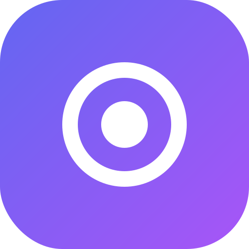

# 🧠 InsightBox

<div align="center">
  
  <p><strong>Yapay Zeka Destekli Not Alma ve Bilgi Yönetim Platformu</strong></p>
  
  [](https://insightbox-orcin.vercel.app/)
  [](https://reactjs.org/)
  [](https://firebase.google.com/)
  [](https://openai.com/)
</div>

## 🌟 Özellikler

- 📝 Akıllı Not Alma ve Organizasyon
- 🤖 OpenAI Destekli İçerik Analizi
- 🔍 Gelişmiş Arama ve Filtreleme
- 📱 Responsive Tasarım
- 🔐 Güvenli Kullanıcı Yetkilendirme
- 🎯 Kategori ve Alt Kategori Yönetimi

## 🚀 Demo

Uygulamayı test etmek için [https://insightbox-orcin.vercel.app/](https://insightbox-orcin.vercel.app/) adresini ziyaret edebilirsiniz.

## 💻 Teknolojiler

- **Frontend:** React, TypeScript, Tailwind CSS
- **Backend:** Firebase (Authentication, Firestore)
- **AI Integration:** OpenAI API
- **Deployment:** Vercel
- **State Management:** React Context API
- **UI Components:** Headless UI, Heroicons
- **Animation:** Framer Motion

## 🛠️ Kurulum

1. Repo'yu klonlayın:
```bash
git clone https://github.com/[your-username]/insightbox.git
```

2. Bağımlılıkları yükleyin:
```bash
npm install
```

3. `.env.development` dosyasını oluşturun ve gerekli environment variable'ları ekleyin:
```env
VITE_FIREBASE_API_KEY=
VITE_FIREBASE_AUTH_DOMAIN=
VITE_FIREBASE_PROJECT_ID=
VITE_FIREBASE_STORAGE_BUCKET=
VITE_FIREBASE_MESSAGING_SENDER_ID=
VITE_FIREBASE_APP_ID=
VITE_FIREBASE_MEASUREMENT_ID=
VITE_OPENAI_API_KEY=
```

4. Geliştirme sunucusunu başlatın:
```bash
npm run dev
```

## 📦 Build

Development build için:
```bash
npm run build:dev
```

Production build için:
```bash
npm run build:prod
```

## 🤝 Katkıda Bulunma

1. Fork'layın
2. Feature branch oluşturun (`git checkout -b feature/amazing-feature`)
3. Değişikliklerinizi commit edin (`git commit -m 'feat: Add amazing feature'`)
4. Branch'inizi push edin (`git push origin feature/amazing-feature`)
5. Pull Request oluşturun

## 📄 Lisans

Bu proje MIT lisansı altında lisanslanmıştır. Detaylar için [LICENSE](LICENSE) dosyasına bakın.

## 📞 İletişim

Proje Sahibi - [@your-twitter](https://twitter.com/your-twitter)

Proje Linki: [https://github.com/[your-username]/insightbox](https://github.com/[your-username]/insightbox)
